### Yan Konichshev; yk2602; Machine Learning, Spring 2024
---
```
1) A brief statement (~paragraph) of what was done to answer the question (narratively
explaining what you did in code to answer the question, at a high level).
2) A brief statement (~paragraph) as to why this was done (why the question was
answered in this way, not by doing something else. Some kind of rationale as to why you
did x and not y or z to answer the question – why is what you did a suitable approach?).
3) A brief statement (~paragraph) as to what was found. This should be as objective and
specific as possible – just the results/facts. Do make sure to include numbers and a
figure (=a graph or plot) in your statement, to substantiate and illustrate it, respectively.
4) A brief statement (~paragraph) as to what you think the findings mean. This is your
interpretation of your findings and should answer the original question.
```
---
### Question 1: Build a logistic regression model. Doing so: What is the best predictor of diabetes and what is the AUC of this model? 

1. First of all, data cleaning. I have prepared the data by examining the frequency distributions and understanding the essense of the data we are working with. Surprisingly, there were almost no rows containing NaN values, so I simply dropped them and normalized all the categorical and ordinal variables (i.e. BMI, general/mental/physical health and etc.) After that was done, I have one-hot-encoded categorical (sex and zodiac sign) variables, and built a simple logistic regression model training it using the preprocessed data. Additionally, I have performed a 10 fold cross validation to tune hyperparameters achieve better generalization of the model.

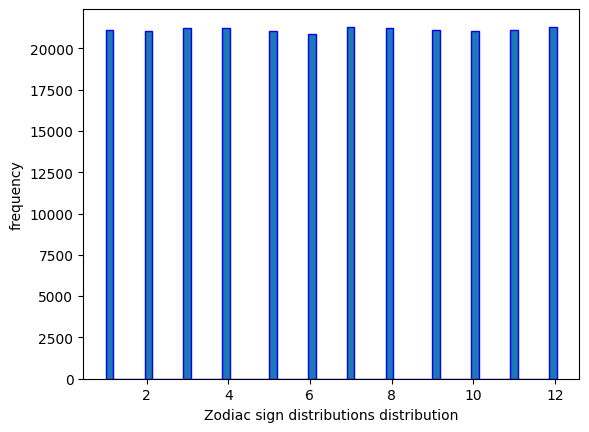

2. I cleaned the data the way I did, simply because I wanted to derive all my predictors to a common scale, so that the model will see which predictors should be given more weight by itself. I have decided to perform a 10-fold CV strategy to make sure that my model would be more or less uniformly performant whenever it sees "new" data. I have decided to drop the zodiac sign predictor because it is not being helpful in predicting diseases as all the samples we had in the dataset were uniformly distributed with regards to the zodiac sign as we have seen above. For figuring what would be the best predictor, I have decided to systematically approach this problem and create 21 different models where we I dropped one predictor at a time to figure out where we have the biggest drop in model performance.

3. I have found that the AUC for the approach I exploited for the logistic regression model is **0.82**, which is quite good given the simple nature of the model and approach I am utilizing. In addition to that, I have found out that the most relevant predictor in my case is **General Health** with a drop of **0.01585844970860062**.Finally, the model also does have a pretty high accuracy of about **0.835**. Please see the graphs below for more details (ROC curve, learning curve for the CV splitter, and performance of different models with one predictor being dropped). 

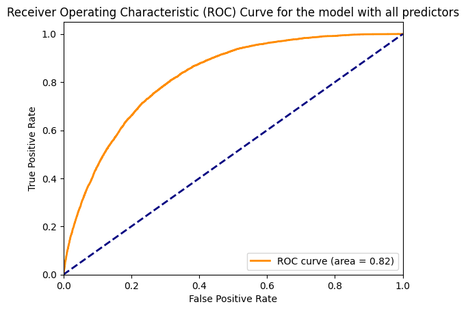
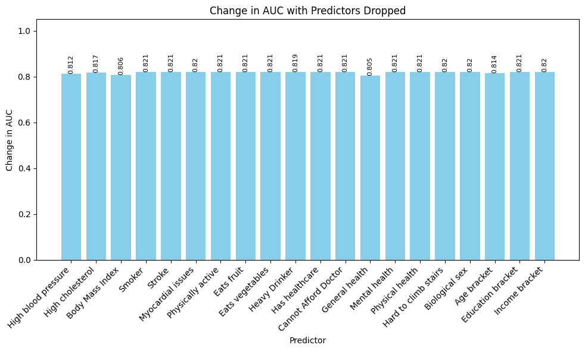
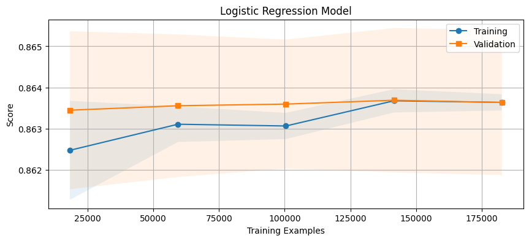

4. It turned out that the model performance is pretty good, as the AUC for this logreg model is 0.82, meaning it 82% of the time whenever our model is trying to classify whether a random person having diabetes is actually having diabetes and the person who doesn't have diabetes is marked as not having diabetes it works properly. Which is 32% percent better than simple guessing, which gives the model a significant advantage and importance. Additionally, **general health and BMI** are apparently the most useful factors in predicting diabetes based on this model, which makes sense as domain knowledge of the disease supports these outcomes.

---

### Question 2: Build a SVM. Doing so: What is the best predictor of diabetes and what is the AUC of this model? 

1. For this task, I followed a similar pipeline with the data I cleaned for the previous question. I have build a Linear SVM so it would converge quickly with my dataset and then estimated its accuracy using k-fold strategy and hypermarater tuning. Finally, I have estimated the AUC score for the full model and for 21 other models with dropped predictors to find out which one is the most significant for this model.
   
2. The rational for this question is simply to run through all the metrics that are available to us (and which I have used in the previous tasks) to compare the model performance against the common baseline. As usual, I used cross validation strategy to make sure that the model would be easily generalizable with new data.
   
3. I have found that the most important predictor for this approach was **BMI** with the AUC dropping down from **0.5314609773465011** by **0.015371866003117907**. But generally, I must admit that this model **was not** as performative as the previous one. I am attaching the results I got and I will discuss them in the following section.

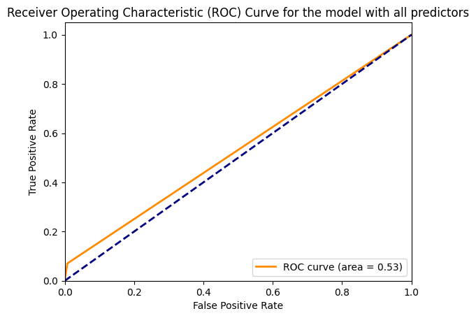
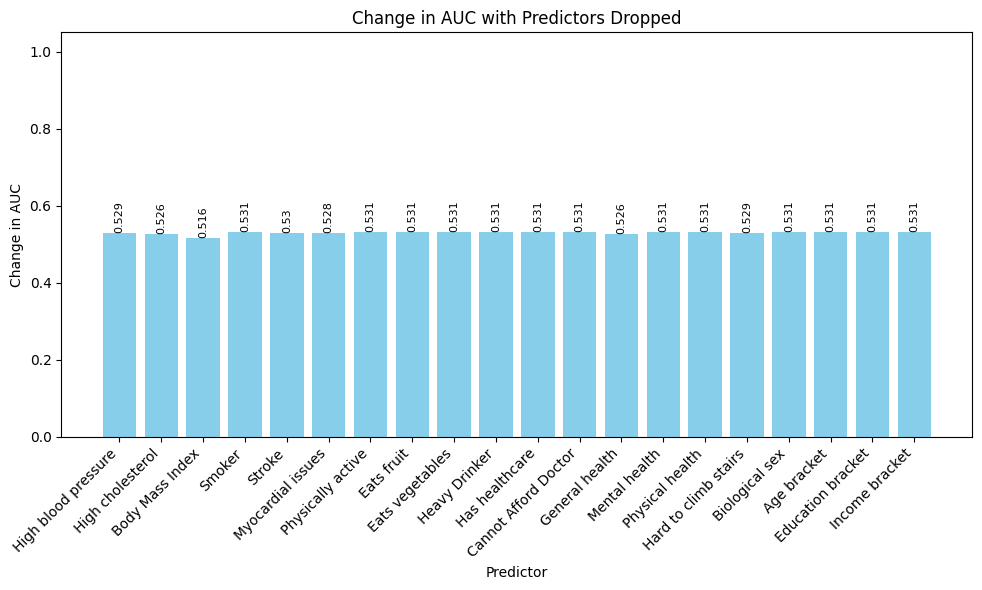
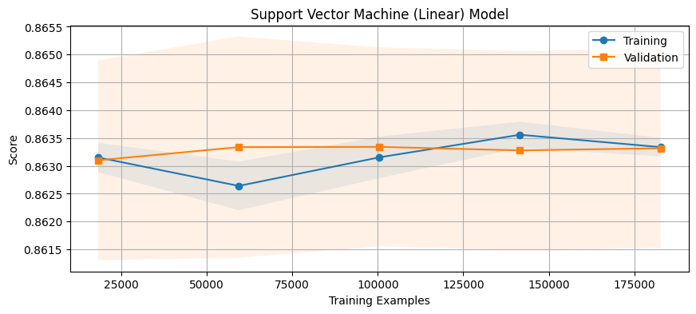
   
4. The main reason for such a relatively high accuracy and low AUC score is mainly due to the linearly inseparable nature of the data we are working with. Additionally, since diabetes is rather uncommon, it is easy for the model to keep calling that the person is not ill and getting an accuracy score higher. Finally, I have to say that the best predictor of diabetes in this approach would be BMI, which is surprizing as it was second best predictor in the previous model. This implies that there is a real significance in the BMI as in the diabetes prediction marker.

---

### Question 3: Use a single, individual decision tree. Doing so: What is the best predictor of diabetes and what is the AUC of this model? 

1. Here I build a single decision tree and evaluated its accuracy and AUC scores. Additionally, I have build 21 other models to figure out which predictor would be the most important one for this model.

2. The intuition stays the same as in previous models, where I tried to build a model and compare it against common benchmarks. As usual, 21 additional models serve as a great way of estimating which exact predictor is the best one for my particular model and my guess would be that 

3. The most significant predictor is for this model is **Body Mass Index**. The drop in the model's performance reaches its peak of **0.013226036025215548** when we have the lowest AUC score of **0.5818026023929124**, compared to the initial **0.5950286384181279** for the full model. Additionally, as one might look at the accuracy chart, we have incredibly high accuracy for the training dataset and moderate results for the validation, which I try to explain in the following section.


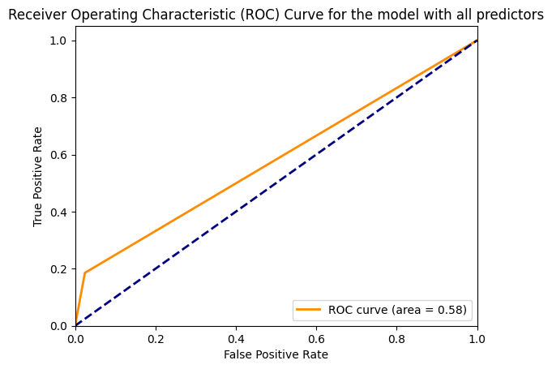
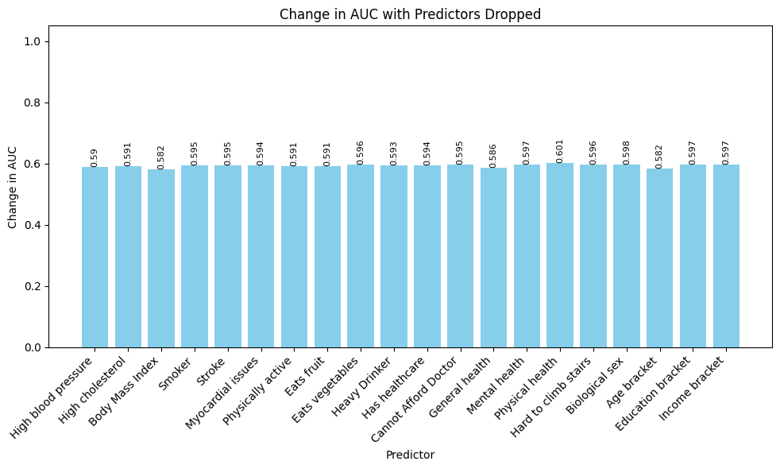
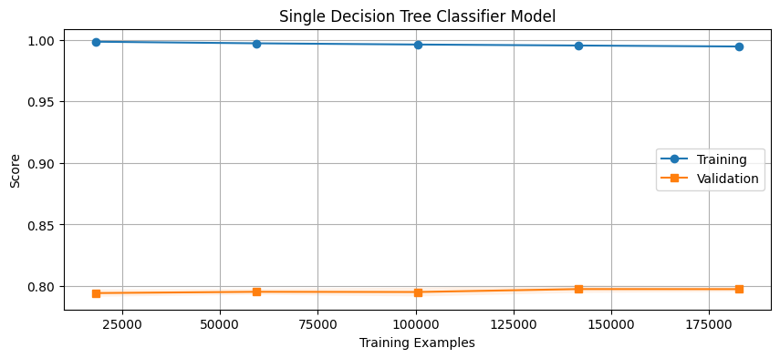

4. The reason for the accuracy being so high for the training set and a drop whenever we using validation set is simply because of the main drawback of the single decision trees, which is that they tend to overfit the training dataset (a.k.a. memorizing it entirely). Thus, the accuracy is nearly 100%, since we simply memorized the data during the training stage. This makes perfect sense once we look at the ROC curve and AUC score, since the model performs poorly when it is trying to classify whether a random person having diabetes is actually having diabetes and conversely. Thus we have low AUC scores and incredible accuracy. The best predictor interestingly stays the same even though we poorly handle classification, we do recognize the importance of **body mass index**. 

---

### Question 4: Build a random forest model. Doing so: What is the best predictor of diabetes and what is the AUC of this model?

1. ABCD
2. ABCD
3. ABCD

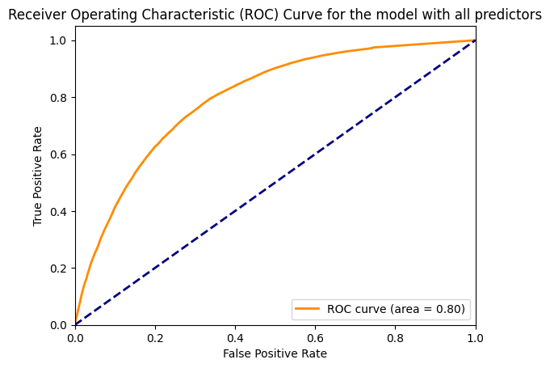
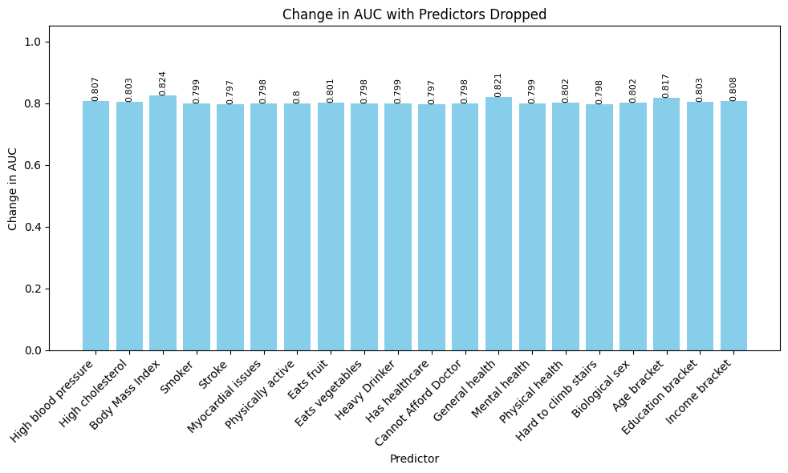
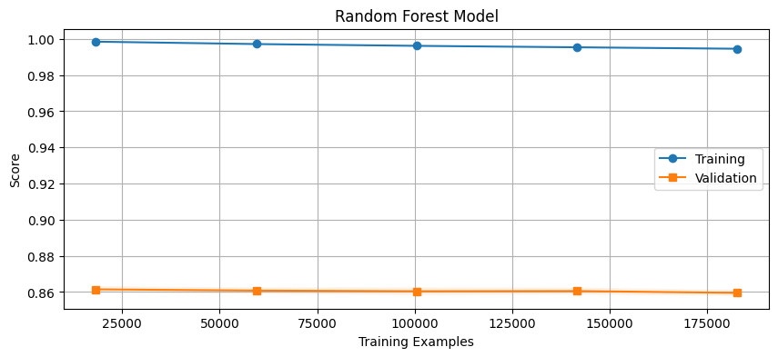

4. ABCD

---

### Question 5: Build a model using adaBoost. Doing so: What is the best predictor of diabetes and what is the AUC of this model?

1. ABCD
2. ABCD
3. ABCD
4. ABCD

---

### Extra Credit

#### A) Which of these 5 models is the best to predict diabetes in this dataset? 


---

#### B) Tell us something interesting about this dataset that is not already covered by the questions above and that is not obvious.
