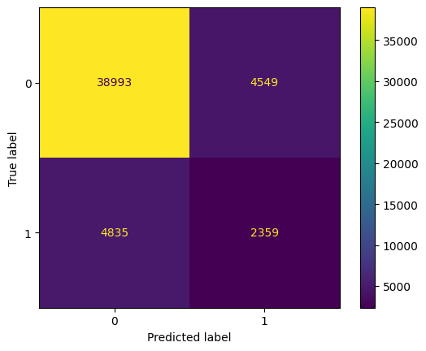
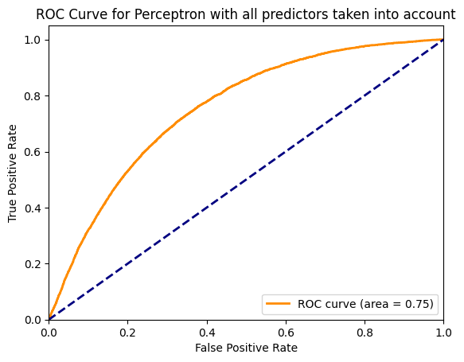
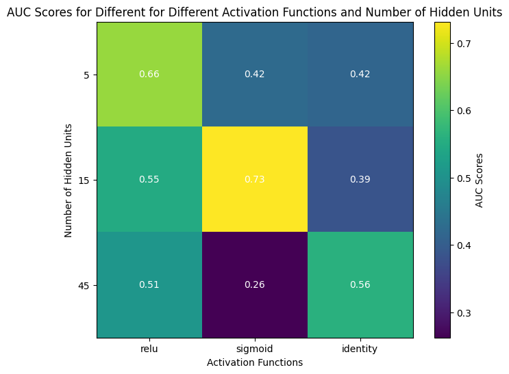
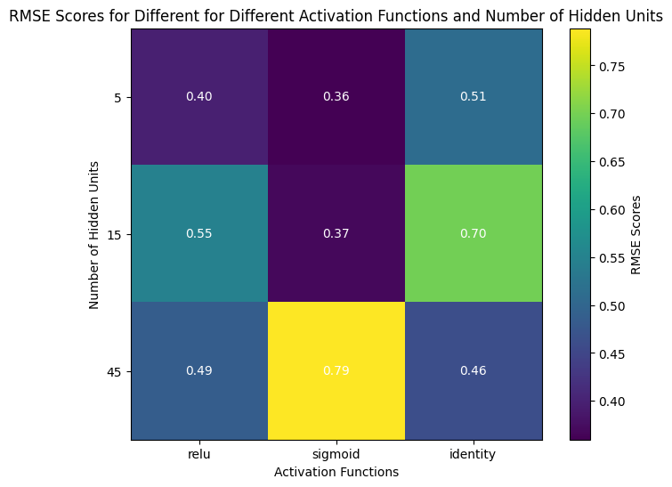
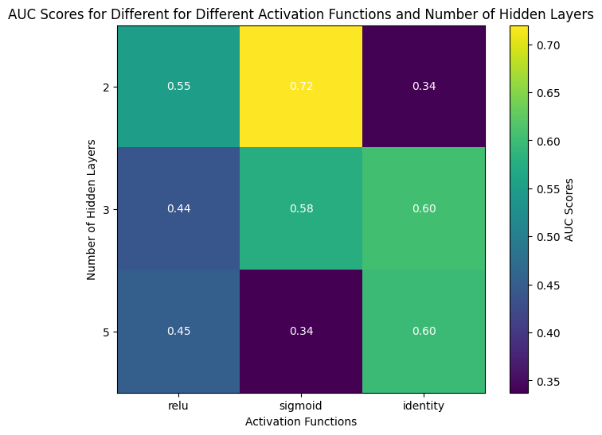
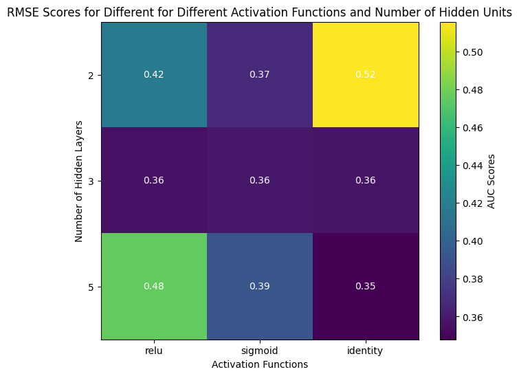
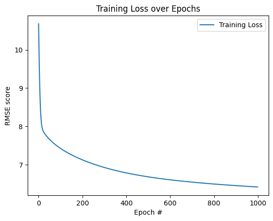

### Homework #4: Diabetes prediction with artificial neural networks. Machine Learning, Spring 2024

### Yan Konichshev; yk2602

---

### Question 1: Build and train a Perceptron (one input layer, one output layer, no hidden layers and no activation functions) to classify diabetes from the rest of the dataset. What is the AUC of this model?

1. First of all, data cleaning. I have prepared the data by examining the frequency distributions and understanding the essense of the data we are working with. Surprisingly, there were almost no rows containing NaN values, so I simply dropped them and standardized all the categorical and ordinal variables (i.e. BMI, general/mental/physical health and etc.) After that was done, I have one-hot-encoded categorical (sex and zodiac sign) variables, and built a simple perceptron. No hidden layers, just inputs are matched to the outputs without intermediary middlemen.

2. I cleaned the data the way I did, simply because I wanted to derive all my predictors to a common scale, so that the model will see which predictors should be given more weight by itself. I have decided to drop the zodiac sign predictor because it is not being helpful in predicting diseases as all the samples we had in the dataset were uniformly distributed (discussed this in the previous homework assignment) with regards to the zodiac sign as we have seen above.
3. I have found that the AUC for the approach I exploited for the logistic regression model is **0.752**, which is not surprizing given that my neural model is barely learning anything about the dataset. In addition to that, I have found out that the perfomance of the model is really not that good, as we have low recall (0.51), low F1 score (0.37), and low precision (0.29) when predicting the presence of diabetes.

<figure>
  
  <figcaption>Fig. 1.1 - Confusion matrix.</figcaption>
</figure>
<figure>
  
  <figcaption>Fig. 1.2 - ROC curve for Perceptron.</figcaption>
</figure>

4. Although I am having quite an impressive AUC score, it doesn't necessarily mean that my model is doing great. Given the recall, precision, and F1 numbers I got for the the prediction of 1 (having diabetes), it rather means that model is mostly calling that patient not ill simply because there is a higher probabilistic chance of having a 0, rather than 1. Thus, there is a need for us to investigate further models and approaches of making relevant improvements to the NN architecture in pursuit of better scores.

---

### Question 2: Build and train a feedforward neural network with at least one hidden layer to classify diabetes from the rest of the dataset. Make sure to try different numbers of hidden layers and different activation functions (at a minimum reLU and sigmoid). Doing so: How does AUC vary as a function of the number of hidden layers and is it dependent on the kind of activation function used (make sure to include “no activation function” in your comparison). How does this network perform relative to the Perceptron?

1. For this task, I build and trained 9 different models, combining different activation functions and number of neurons in the single hidden layer. After that, I estimated the performance of the models by evaluating the AUC + RMSEs for every model and mapping them to the heatmaps.
2. The rational for this question is simply to run through all the potential solutions and see which one would be the best one for my dataset. I have tried to build a model and compare it against common benchmarks, after that taking the best performing one and analyzing it.
3. I have found that AUC is definetely sensitive with respect to the number of hidden layers and the activation function used. The best AUC score I have achieved was **0.70** with the following configuration: 1 hidden layer, 15 neurons, and Sigmoid activation function. This is roughly as good as the Perceptron model, but it is still not the best one. The best RMSE score I have achieved was **0.35** with the following same configurations.

<figure>
  
  <figcaption>Fig. 2.1 - Heat map of different models and AUC scores.</figcaption>
</figure>
<figure>
  
  <figcaption>Fig. 2.2 - Heat map of different models and RMSE scores.</figcaption>
</figure>
   
4. I can say that one layer was not enough to learn all the features of the data, and thus comes the result even poorer than the Perceptron. One potential reason could be because we don't have enough layers to get to the actual feature extraction. The results I got are interesting as the Sigmoid function is not the best performing activation function for NN, but it seems to be the best one for this particular dataset. This is also confirmed by the RMSE scores, as the best RMSE score was achieved with the same configuration. It is also worth mentioning that all the models were sensitive to the random seed of the train/test data split. This implies that the model is not generalizable and we need to take averages of the models to make sure that the model is generalizable.

---

### Question 3: Build and train a “deep” network (at least 2 hidden layers) to classify diabetes from the rest of the dataset. Given the nature of this dataset, is there a benefit of using a CNN for the classification?

1. Here I build a single decision tree and evaluated its accuracy and AUC scores. Additionally, I have build 21 other models to figure out which predictor would be the most important one for this model.

2. The intuition stays the same as in previous models, where I tried to build a model and compare it against common benchmarks. As usual, 21 additional models serve as a great way of estimating which exact predictor is the best one for my particular model and my guess would be that

3. The most significant predictor is for this model is **Body Mass Index**. The drop in the model's performance reaches its peak of **0.013226036025215548** when we have the lowest AUC score of **0.5818026023929124**, compared to the initial **0.5950286384181279** for the full model. Additionally, as one might look at the accuracy chart, we have incredibly high accuracy for the training dataset and moderate results for the validation, which I try to explain in the following section.

<figure>
  
  <figcaption>Fig. 3.1 - Heat map of different models and AUC scores.</figcaption>
</figure>
<figure>
  
  <figcaption>Fig. 3.2 - Heat map of different models and RMSE scores.</figcaption>
</figure>

4. The reason for the accuracy being so high for the training set and a drop whenever we using validation set is simply because of the main drawback of the single decision trees, which is that they tend to overfit the training dataset (a.k.a. memorizing it entirely). Thus, the accuracy is nearly 100%, since we simply memorized the data during the training stage. This makes perfect sense once we look at the ROC curve and AUC score, since the model performs poorly when it is trying to classify whether a random person having diabetes is actually having diabetes and conversely. Thus we have low AUC scores and incredible accuracy. The best predictor interestingly stays the same even though we poorly handle classification, we do recognize the importance of **body mass index**.

---

### Question 4: Build and train a feedforward neural network with one hidden layer to predict BMI from the rest of the dataset. Use RMSE to assess the accuracy of your model. Does the RMSE depend on the activation function used?

1. For this question, I have built a random forest model and created 21 separate models to assess the AUC of each respective one. After that, I have additionally performed the k-fold cross validation for sake of making sure that the model could be generalized. The pipeline stays the same for this question as it was in the previous ones, since the goal is similar.
2. The rationale pretty much is the same, its just that the approach and the modelling preference is different in this case. We are interested in exploring which binary classifier would be performing the best for this specific dataset, and thus using random forest is yet another way of achieving our ultimate goal. Therefore, I tried to build models and compare them against common benchmarks, which I introduced earlier.
3. Random forest produced a beatiful ROC curve, resulting in **AUC score of 80%**. Interestingly, as one might look at the accuracy scores of the training and validation datasets, we have incredibly high accuracy (~100%) for the training dataset and moderate results (~85-86%) for the validation, which I will address in the following section. Additionally, the best predictor for this model is **absense or presense of stroke**, as our model's performance dropped to 0.797, compared to the 0.8 of the full model. This is interesting, as it contradicts previous findings of importance of the BMI and health status.

<figure>
  
  <figcaption>Fig. 3.1 - Heat map of different models and AUC scores.</figcaption>
</figure>

4. As we have seen, there is a significant gap between the accuracy on the training set and the validation set, along with a high AUC which suggests potential overfitting of this random forest model. This might be because of a number of reasons, but I suggest that the main one would be imbalance of my classes in this dataset. It is obvious that we have more people without diabetes than people with. Thus, due to this significant imbalance. This is also illustrated and confirmed by the following figure. Thus, this model would not be the best one to judge upon the performance. Maybe this is a reason why we have totally different best predictor with this model.

---

### Question 5: Build and train a neural network of your choice to predict BMI from the rest of your dataset. How low can you get RMSE and what design choices does RMSE seem to depend on?

1. For this question, the pipeline of my actions was to create a deep network where each following layer would have a decreasing number of neurons. I have used ReLU activation since it is the best performing activation function so far. Finally, I have estimated the RMSE scores as it was training through the epochs and plotted it to realize the progression of my RMSE.
2. For this question, I thought that since we are trying to perform a regression task on the dataset, it would be a good idea to build a deep network with a decreasing number of neurons per layer. This is a common practice in the deep learning community, as it is believed that the model would be able to learn the most important features of the dataset and would be able to generalize better. Thus, I have built a model and trained it on the dataset.
3. I have got the following results with best RMSE score being **6.2396045**. RMSE seemed to depend on the activation function and the number of neurons per layer. Also, my design choice of methodologically decreasing the number of neurons from layer to layer seemed to be working exceptionally well, as I have managed to achieve the best RMSE score with this approach.

<figure>
  
  <figcaption>Fig. 5.1 - RMSE vs. epochs function.</figcaption>
</figure>

4. I have to say that the model design and arhictectual decisions I made was due to the previous experience I got when working on the previous question. This has led to an increased intuition about what are the most influencing factors when building a model. I have to say that the most important factor for this model was the number of neurons per layer and the activation function. I have tried to decrease the number of neurons per layer, as it is a common practice in the deep learning community. This has led to the best RMSE score I have achieved so far.

---

### Extra Credit

#### A) Are there any predictors/features that have effectively no impact on the accuracy of these models? If so, please list them and comment briefly on your findings

I do believe that the zodiac sign has absolutely no impact on the accuracy of the models. This is due to the fact that the zodiac sign is a random variable and it is not related to the health status of the person. This is also confirmed by the fact that the zodiac sign was not the most important predictor in any of the models I have built. Thus, I would suggest that the zodiac sign is not a good predictor for the health status of the person and thus it was dropped from the dataset before the analysis.

---

#### B) Write a summary statement on the overall pros and cons of using neural networks to learn from the same dataset as in the prior homework, relative to using classical methods (logistic regression, SVM, trees, forests, boosting methods). Any overall lessons?

1. Training is slow. Especially if NN are deep and complex.
2. They tend to overfit and memorize the data. This is always a problem and thus we need to make sure the solution is generalizable by penalizing the model for overcomplexity.
3. NN are good at learning complex patterns in the data. This is a good thing, as we can learn from the data more effectively.
4. I noticed that our case was extremely prone to the random seed I passed when splitting the dataset. This is not good, as it requires a lot of training and taking averages to make sure that the model is generalizable. This is a big drawback of the NN, as we never would have deterministic outputs of models
