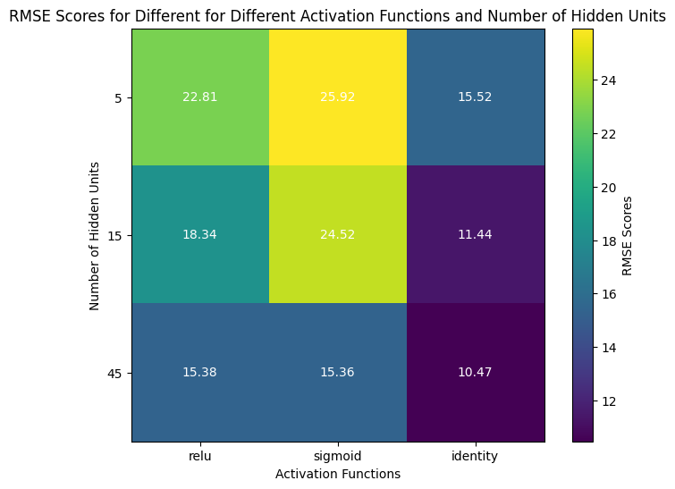

### Homework #3: Diabetes prediction. Machine Learning, Spring 2024

### Yan Konichshev; yk2602

---

### Question 1: Build a logistic regression model. Doing so: What is the best predictor of diabetes and what is the AUC of this model?

1. First of all, data cleaning. I have prepared the data by examining the frequency distributions and understanding the essense of the data we are working with. Surprisingly, there were almost no rows containing NaN values, so I simply dropped them and normalized all the categorical and ordinal variables (i.e. BMI, general/mental/physical health and etc.) After that was done, I have one-hot-encoded categorical (sex and zodiac sign) variables, and built a simple logistic regression model training it using the preprocessed data. Additionally, I have performed a 10 fold cross validation to tune hyperparameters achieve better generalization of the model.

2. I cleaned the data the way I did, simply because I wanted to derive all my predictors to a common scale, so that the model will see which predictors should be given more weight by itself. I have decided to perform a 10-fold CV strategy to make sure that my model would be more or less uniformly performant whenever it sees "new" data. I have decided to drop the zodiac sign predictor because it is not being helpful in predicting diseases as all the samples we had in the dataset were uniformly distributed with regards to the zodiac sign as we have seen above. For figuring what would be the best predictor, I have decided to systematically approach this problem and create 21 different models where we I dropped one predictor at a time to figure out where we have the biggest drop in model performance.

3. I have found that the AUC for the approach I exploited for the logistic regression model is **0.82**, which is quite good given the simple nature of the model and approach I am utilizing. In addition to that, I have found out that the most relevant predictor in my case is **General Health** with a drop of **0.01585844970860062**.Finally, the model also does have a pretty high accuracy of about **0.835**. Please see the graphs below for more details (ROC curve, learning curve for the CV splitter, and performance of different models with one predictor being dropped).

4. It turned out that the model performance is pretty good, as the AUC for this logreg model is 0.82, meaning it 82% of the time whenever our model is trying to classify whether a random person having diabetes is actually having diabetes and the person who doesn't have diabetes is marked as not having diabetes it works properly. Which is 32% percent better than simple guessing, which gives the model a significant advantage and importance. Additionally, **general health and BMI** are apparently the most useful factors in predicting diabetes based on this model, which makes sense as domain knowledge of the disease supports these outcomes.

---

### Question 2: Build a SVM. Doing so: What is the best predictor of diabetes and what is the AUC of this model?

1. For this task, I followed a similar pipeline with the data I cleaned for the previous question. I have build a Linear SVM so it would converge quickly with my dataset and then estimated its accuracy using k-fold strategy and hypermarater tuning. Finally, I have estimated the AUC score for the full model and for 21 other models with dropped predictors to find out which one is the most significant for this model.
2. The rational for this question is simply to run through all the metrics that are available to us (and which I have used in the previous tasks) to compare the model performance against the common baseline. As usual, I used cross validation strategy to make sure that the model would be easily generalizable with new data.
3. I have found that the most important predictor for this approach was **BMI** with the AUC dropping down from **0.5314609773465011** by **0.015371866003117907**. But generally, I must admit that this model **was not** as performative as the previous one. I am attaching the results I got and I will discuss them in the following section.

   
4. The main reason for such a relatively high accuracy and low AUC score is mainly due to the linearly inseparable nature of the data we are working with. Additionally, since diabetes is rather uncommon, it is easy for the model to keep calling that the person is not ill and getting an accuracy score higher. Finally, I have to say that the best predictor of diabetes in this approach would be BMI, which is surprizing as it was second best predictor in the previous model. This implies that there is a real significance in the BMI as in the diabetes prediction marker.

---

### Question 3: Use a single, individual decision tree. Doing so: What is the best predictor of diabetes and what is the AUC of this model?

1. Here I build a single decision tree and evaluated its accuracy and AUC scores. Additionally, I have build 21 other models to figure out which predictor would be the most important one for this model.

2. The intuition stays the same as in previous models, where I tried to build a model and compare it against common benchmarks. As usual, 21 additional models serve as a great way of estimating which exact predictor is the best one for my particular model and my guess would be that

3. The most significant predictor is for this model is **Body Mass Index**. The drop in the model's performance reaches its peak of **0.013226036025215548** when we have the lowest AUC score of **0.5818026023929124**, compared to the initial **0.5950286384181279** for the full model. Additionally, as one might look at the accuracy chart, we have incredibly high accuracy for the training dataset and moderate results for the validation, which I try to explain in the following section.

4. The reason for the accuracy being so high for the training set and a drop whenever we using validation set is simply because of the main drawback of the single decision trees, which is that they tend to overfit the training dataset (a.k.a. memorizing it entirely). Thus, the accuracy is nearly 100%, since we simply memorized the data during the training stage. This makes perfect sense once we look at the ROC curve and AUC score, since the model performs poorly when it is trying to classify whether a random person having diabetes is actually having diabetes and conversely. Thus we have low AUC scores and incredible accuracy. The best predictor interestingly stays the same even though we poorly handle classification, we do recognize the importance of **body mass index**.

---

### Question 4: Build a random forest model. Doing so: What is the best predictor of diabetes and what is the AUC of this model?

1. For this question, I have built a random forest model and created 21 separate models to assess the AUC of each respective one. After that, I have additionally performed the k-fold cross validation for sake of making sure that the model could be generalized. The pipeline stays the same for this question as it was in the previous ones, since the goal is similar.
2. The rationale pretty much is the same, its just that the approach and the modelling preference is different in this case. We are interested in exploring which binary classifier would be performing the best for this specific dataset, and thus using random forest is yet another way of achieving our ultimate goal. Therefore, I tried to build models and compare them against common benchmarks, which I introduced earlier.
3. Random forest produced a beatiful ROC curve, resulting in **AUC score of 80%**. Interestingly, as one might look at the accuracy scores of the training and validation datasets, we have incredibly high accuracy (~100%) for the training dataset and moderate results (~85-86%) for the validation, which I will address in the following section. Additionally, the best predictor for this model is **absense or presense of stroke**, as our model's performance dropped to 0.797, compared to the 0.8 of the full model. This is interesting, as it contradicts previous findings of importance of the BMI and health status.

4. As we have seen, there is a significant gap between the accuracy on the training set and the validation set, along with a high AUC which suggests potential overfitting of this random forest model. This might be because of a number of reasons, but I suggest that the main one would be imbalance of my classes in this dataset. It is obvious that we have more people without diabetes than people with. Thus, due to this significant imbalance. This is also illustrated and confirmed by the following figure. Thus, this model would not be the best one to judge upon the performance. Maybe this is a reason why we have totally different best predictor with this model.

---

### Question 5: Build a model using adaBoost. Doing so: What is the best predictor of diabetes and what is the AUC of this model?

1. For this question, the pipeline of actions stays pretty much the same -- building a full model, estimating the AUC score for it, then creating 21 separate models and evaluating them one by one. Traditionally, I have been working on the cross validation for this dataset to show the learning curve trajectory.
2. I have made sure that we validate all the results on the fly and tune the hypermaraters by performing k-fold cross validation on the training and validation sets. I also made sure to use the default setting of the AdaBoost provided by the `sklearn` library to avoid overcomplication of the model. This is because the dataset we are using has >250k datapoints and 21 features we have to train on, and adaboost could become computationally intense in these cases.
3. I have got the following results with best predictor being **absense or presense of physical activity** with a drop in the model's performance of **0.025404998419649383** points. I would also like to notice that this predictor is merely the best one, since many more predictors showed almost the same degree of importance. Thus, adaboost was not an efficient way of analyzing which predictor would be the best one due to the ambiguity of the importance of all these factors.

4. Interestingly, the performance of AdaBoost Classifier was not significantly better than the one for the single decision tree classifier. I presume that this is because AdaBoost classifier is using the decision tree under the hood and since I have not involved any significant feature engineering tactics to improve the performance of this model, it has not been quite as effective as it might have been.

---

### Extra Credit

#### A) Which of these 5 models is the best to predict diabetes in this dataset?

I suggest that ironically very first (and the simplest one) logistic regression handles the binary classification of our dataset in the best possible way. This is because we managed to achieve both pretty high results for the AUC score (82% for the full model) and high accuracy of the results (~85-86%). Please see the evidence for this in the **figures attached to the question 1, section 3**. This trade-off between having high accuracy and high AUC score is the best one we saw accross all the models, and thus I suggest it is the best one so far to predict diabetes.

---

#### B) Tell us something interesting about this dataset that is not already covered by the questions above and that is not obvious.

I found it interesting that the BMI index of the dataset is the only normally distributed continous varible in this entire dataset. This is again a sort of a verification that the data is real and not synthetically infused.

## 
