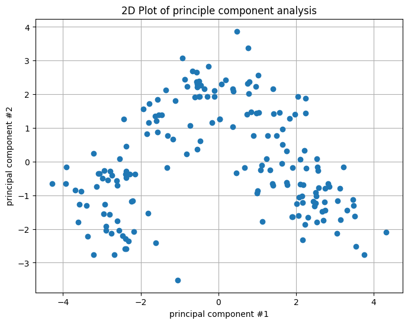
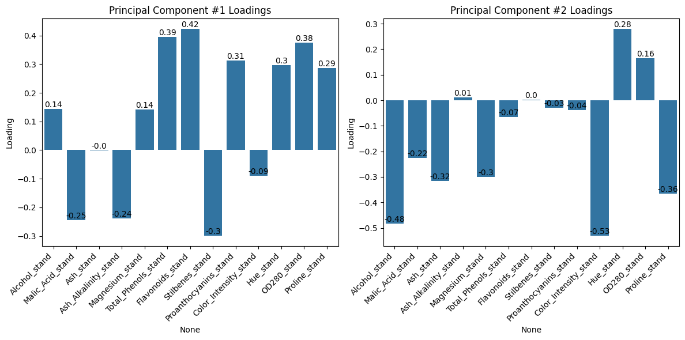
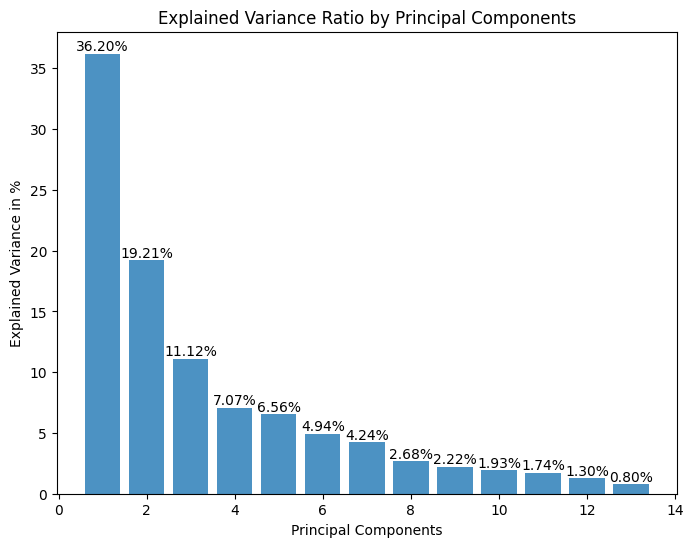
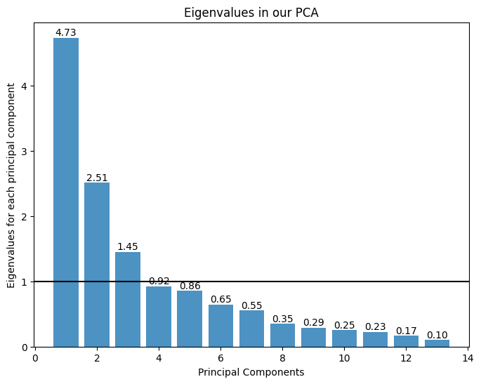
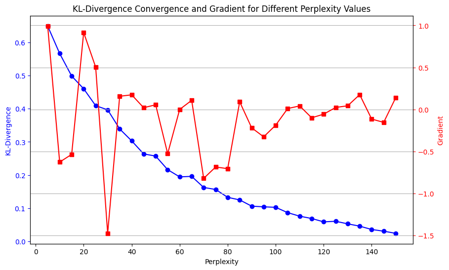
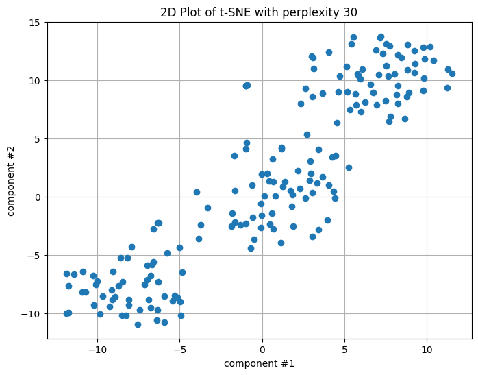
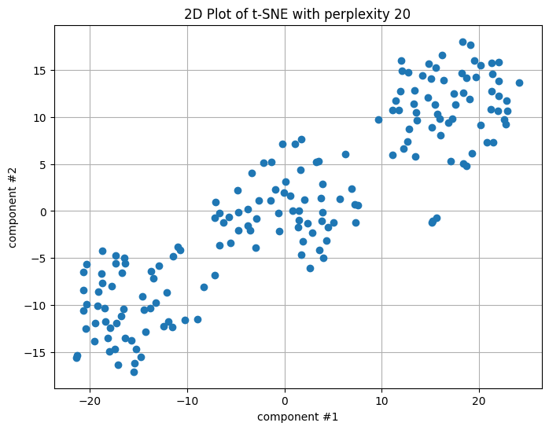
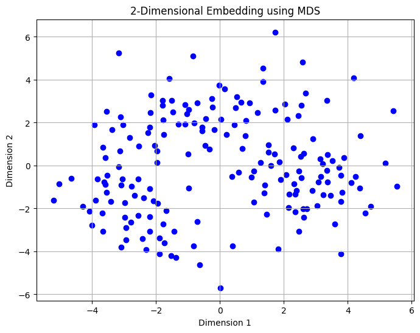
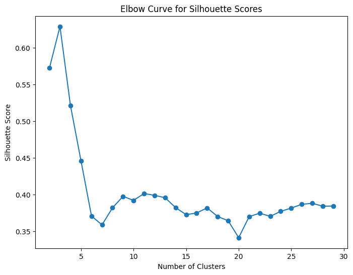
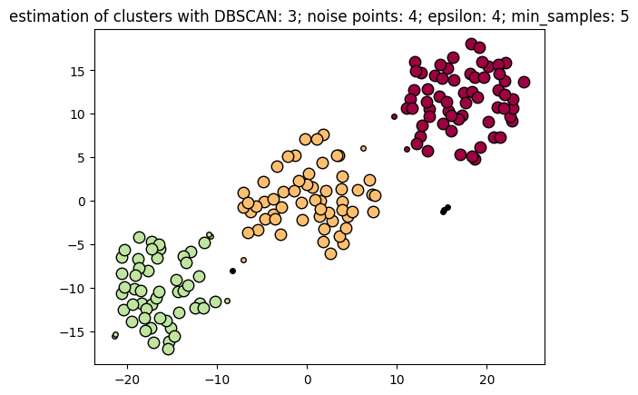

### Homework #5: Unsupervised learning: Wines. Machine Learning, Spring 2024

### Yan Konichshev; yk2602

---

### Question 1: Do a PCA on the data. How many Eigenvalues are above 1? Plotting the 2D solution (projecting the data on the first 2 principal components), how much of the variance is explained by these two dimensions, and how would you interpret them?

1. For this and other questions I have started with standardzing the data and then applying PCA algorithm. Then, I plotted the variance explainability + eigenvalues across all 13 principal compenents to see how many of them have eigenvalues above 1. Additionally, I created PC loading maps for each of the 2 dimensions. Finally, I plotted the 2D solution.

2. I standardized the data because all the dimension reduction methods are sensitive to scales. I did plot the variance explained by each of the principal components to see how much of the total variance is explained by first 2 PCs, and the eigenvalues to see how many of them are above 1. I also created PC loading maps for each of the 2 dimensions to see which features are most important for each of them.

3. There are 3 eigenvalues above 1, which means that the first 3 principal components explain more variance than a single feature. The first 2 PCs explain 55% of the total variance, and the third PC explains 11%. The first PC is mostly influenced by the features that contribute to a wine's **color, aroma, taste**, clarity, and structure, while the second PC is mostly influenced by the features related to **wine's mineral composition, alcohol concentration, depth and saturation of the color, texture**. Please see the figures below to explore the results I got.

<figure>
  
  <figcaption>Fig. 1.1 - 2D Plot of principal components.</figcaption>
</figure>
<figure>
  
  <figcaption>Fig. 1.2 - Principal Component Loadings.</figcaption>
</figure>
<figure>
  
  <figcaption>Fig. 1.3 - Explained Variance.</figcaption>
</figure>
<figure>
  
  <figcaption>Fig. 1.4 - Eigenvalues.</figcaption>
</figure>

4. Interpretation-wise, I am thinking that the first principal component is responsible for the primary factors that determine what kind of wine are we dealing with (i.e. sensory indicators seen by the humans) -- color, aroma, taste. It is not surprising as humans probably created all these different sorts of wines to have different sensory experiences. The second principal component might be reflective of the chemical filling of the wine. Top contributors to this component were alcohol concentration, proline content (amino acids), and color intensity. Those features are rather something chemists use to describe the nature of the liquid when analyzing them.

---

### Question 2: Use t-SNE on the data. How does KL-divergence depend on Perplexity (vary Perplexity from 5 to 150)? Make sure to plot this relationship. Also, show a plot of the 2D component with a Perplexity of 20.

1.
2.
3.

<figure>
  
  <figcaption>Fig. 2.1 - KL-convergence with respect to perplexity.</figcaption>
</figure>
<figure>
  
  <figcaption>Fig. 2.2 - t-SNE with perplexity of 30 (optimal according to the previous convergence).</figcaption>
</figure>
<figure>
  
  <figcaption>Fig. 2.3 - t-SNE with perplexity of 20.</figcaption>
</figure>
   
4.

---

### Question 3: Use MDS on the data. Try a 2-dimensional embedding. What is the resulting stress of this embedding? Also, plot this solution and comment on how it compares to t-SNE.

1.
2.
3. <figure>
     
     <figcaption>Fig. 3.1 - .</figcaption>
   </figure>
   <figure>
     
     <figcaption>Fig. 3.2 - .</figcaption>
   </figure>

4.

---

### Question 4: Building on one of the dimensionality reduction methods above that yielded a 2D solution (1-3, your choice), use the Silhouette method to determine the optimal number of clusters and then use kMeans with that number (k) to produce a plot that represents each wine as a dot in a 2D space in the color of its cluster. What is the total sum of the distance of all points to their respective clusters centers, of this solution?

1.
2.
3.

<figure>
  
  <figcaption>Fig. 4.1 - .</figcaption>
</figure>

4.

---

### Question 5: Building on one of the dimensionality reduction methods above that yielded a 2D solution (1-3, your choice), use dBScan to produce a plot that represents each wine as a dot in a 2D space in the color of its cluster. Make sure to suitably pick the radius of the perimeter (“epsilon”) and the minimal number of points within the perimeter to form a cluster (“minPoints”) and comment on your choice of these two hyperparameters.

1.
2.
3.

<figure>
  
  <figcaption>Fig. 5.1 - RMSE vs. epochs function.</figcaption>
</figure>

4.

---

### Extra Credit

#### A) Given your answers to all of these questions taken together, how many different kinds of wine do you think there are and how do they differ?

---

#### B) Is there anything of interest you learned about wines from exploring this dataset with unsupervised machine learning method that is worth noting and not already covered in the questions above?
