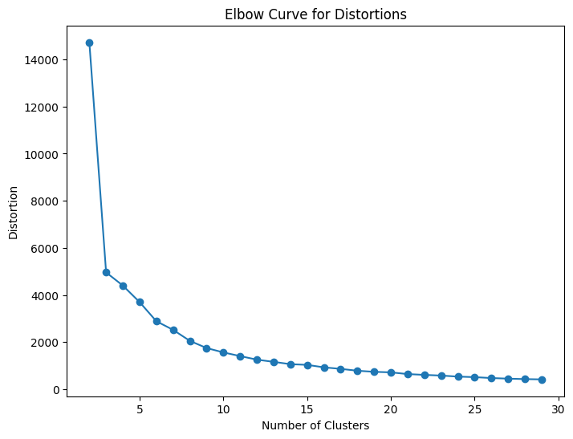
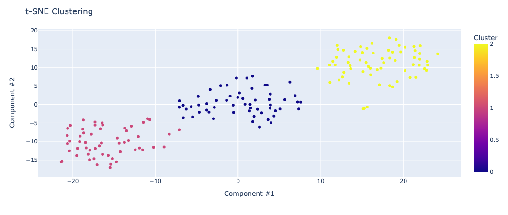
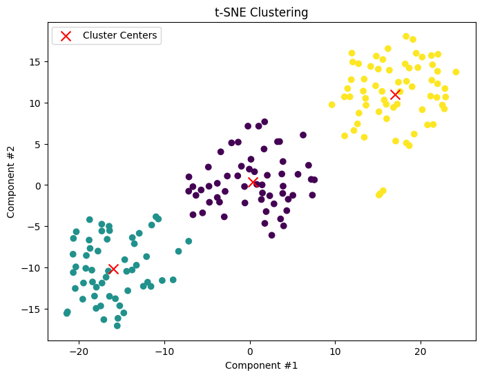

### Homework #5: Unsupervised learning: Wines. Machine Learning, Spring 2024

### Yan Konichshev; yk2602

---

### Question 1: Do a PCA on the data. How many Eigenvalues are above 1? Plotting the 2D solution (projecting the data on the first 2 principal components), how much of the variance is explained by these two dimensions, and how would you interpret them?

1. For this and other questions I have started with standardzing the data and then applying PCA algorithm. Then, I plotted the variance explainability + eigenvalues across all 13 principal compenents to see how many of them have eigenvalues above 1. Additionally, I created PC loading maps for each of the 2 dimensions. Finally, I plotted the 2D solution.

2. I standardized the data because all the dimension reduction methods are sensitive to scales. I did plot the variance explained by each of the principal components to see how much of the total variance is explained by first 2 PCs, and the eigenvalues to see how many of them are above 1. I also created PC loading maps for each of the 2 dimensions to see which features are most important for each of them.

3. There are 3 eigenvalues above 1, which means that the first 3 principal components explain more variance than a single feature. The first 2 PCs explain 55% of the total variance, and the third PC explains 11%. The first PC is mostly influenced by the features that contribute to a wine's **color, aroma, taste**, clarity, and structure, while the second PC is mostly influenced by the features related to **wine's mineral composition, alcohol concentration, depth and saturation of the color, texture**. Please see the figures below to explore the results I got.

<figure>
  
  <figcaption>Fig. 1.1 - 2D Plot of principal components.</figcaption>
</figure>
<figure>
  
  <figcaption>Fig. 1.2 - Principal Component Loadings.</figcaption>
</figure>
<figure>
  
  <figcaption>Fig. 1.3 - Explained Variance.</figcaption>
</figure>
<figure>
  
  <figcaption>Fig. 1.4 - Eigenvalues.</figcaption>
</figure>

4. Interpretation-wise, I am thinking that the first principal component is responsible for the primary factors that determine what kind of wine are we dealing with (i.e. sensory indicators seen by the humans) -- color, aroma, taste. It is not surprising as humans probably created all these different sorts of wines to have different sensory experiences. The second principal component might be reflective of the chemical filling of the wine. Top contributors to this component were alcohol concentration, proline content (amino acids), and color intensity. Those features are rather something chemists use to describe the nature of the liquid when analyzing them.

---

### Question 2: Use t-SNE on the data. How does KL-divergence depend on Perplexity (vary Perplexity from 5 to 150)? Make sure to plot this relationship. Also, show a plot of the 2D component with a Perplexity of 20.

1. First of all, I have tried all sorts of t-SNE models with different perplexities and measured how the KL-convergence is changing for them. I have made sure to plot 2 dimensions with perplexity of 20, and additionally I plotted how the KL-convergence is changing + rate of change for those models.
2. The rationale for plotting the KL-convergence change and rate of change was to find out the perplexity at which KL-convergence drops the most. This way, I thought I would be able to find the most optimal perplexity value. Additionaly, I was interested in exploring how different perplexity values would affect the performance of the model and how well the data would be separated in the end.
3. t-SNE with perplexity of 20 and 30 were the most effecient among the other models. The most efficient in my opinion, was the model with the perplexity of 20, since it is providing the easiest separation between the clusters (with KL-convergence around 0.45). Additionally, I found that the higher the perplexity value was, the lower the KL-convergence was. The highest rates of changes were detected at the initial steps, which probably implies that the lower perplexity values make the most difference and sense, since we are more interested in local views of our clusters.

<figure>
  
  <figcaption>Fig. 2.1 - KL-convergence with respect to perplexity.</figcaption>
</figure>
<figure>
  
  <figcaption>Fig. 2.2 - t-SNE with perplexity of 30 (optimal according to the previous convergence).</figcaption>
</figure>
<figure>
  
  <figcaption>Fig. 2.3 - t-SNE with perplexity of 20.</figcaption>
</figure>
   
4. t-SNE with perplexity of 20 and 30 were the most effecient among the other models. This is because higher perplexity values tend to result in more global views of the data, where points are spread out more evenly in the embedding space. Lower perplexity values lead to more local views, where clusters and small-scale structures are emphasized. In our case, we were more interested in local views, thus lower perplexity values yielded the best "separation" of potential clusters.

---

### Question 3: Use MDS on the data. Try a 2-dimensional embedding. What is the resulting stress of this embedding? Also, plot this solution and comment on how it compares to t-SNE.

1. I have simply used the basic MDS class to build a 2D projection of the data. After that, I have found what was the stress of this lower-dimensional embeddings.
2. This was done in the same spirit as previous questions and experiments. I wanted to know one metric that would show me the performance of the algorithm as well as to see how well the datapoints are mapped onto a 2D space. 
3. Multidimensional scaling aims to preserve the distances between pairs of data points, focusing on pairs of distant points in the original space. The stress in MDS measures the difference between the observed reaction time between semantic pairs and the estimated one using one or more estimated stimuli dimensions. The lower the stress the better the fit. As we discovered with the MDS approach the stress of the embedding: **21021.36**, which is an extremely high value, thus one can conclude that this is probably not the best dimension reduction approach given the nature of our dataset.
   
<figure>
 
 <figcaption>Fig. 3.1 - MDS results.</figcaption>
</figure>

4. Using MDS on our dataset is not the best idea, since we are seeing high stress value (low fit to the data) + fairly sparse plot of datapoints on it, which makes it harder than with previous experiments to conduct any clusterrings, as it is super ambigious to agree on the exact most-optimal number of clusters. 

---

### Question 4: Building on one of the dimensionality reduction methods above that yielded a 2D solution (1-3, your choice), use the Silhouette method to determine the optimal number of clusters and then use kMeans with that number (k) to produce a plot that represents each wine as a dot in a 2D space in the color of its cluster. What is the total sum of the distance of all points to their respective clusters centers, of this solution?

1. I build on top of t-SNE solution by identifying the number **k** with the use of silhouette scores and distortion scores. After receiving the ultimate number of clusters, I have decided to build on top on that, and plot the solution. See the next sections for more details.
2. I have decided to build on top of the t-SNE solution as it provided the best separation of my data, thus clusterring should be done pretty easily. Additionally, I thought that measuring both distortion and silhouette scores can help me with cross-verifying the results for the number **k**, and surprisingly enough both distortion and silhouette scores agreed on the same number.
3. The optimal number of centroids as derived by the silhouette scores is 3. This was done using the grid search by maximizing the results of the silhouette scores and minimizing the distortion. k-Means algorithm knowing this number further derived the location of each individual cluster center, and as we can see from the figures below, they are located beautifully in the centers of our potential clusters. The total sum of the sum of the distance of all points to their respective clusters centers is **862.7615**.

<figure>
  
  <figcaption>Fig. 4.1 - Sharp increase of the silhouette score when k=3.</figcaption>
</figure>
<figure>
  
  <figcaption>Fig. 4.2 - Drop of distortion (distance to the centroids) when k=3.</figcaption>
</figure>
<figure>
  
  <figcaption>Fig. 4.3 - t-SNE clustering with 3 clusters derived by k-Means.</figcaption>
</figure>
<figure>
  
  <figcaption>Fig. 4.4 - k-Means clustering with 3 centroids.</figcaption>
</figure>

4. k-Means algorithm with appropriate hyperparameters yielded great results, as we saw from the plots above. Our previously detected 3 areas in t-SNE finally were allocated to potential clusters. Additionally, it was great to see that there is a largest drop in distortions for the most appropriate number of clusters as well as the largest increase of the silhouette score for that very same value. I think our dataset might be actually having just 3 major clusters (aka three kinds of wine).

---

### Question 5: Building on one of the dimensionality reduction methods above that yielded a 2D solution (1-3, your choice), use dBScan to produce a plot that represents each wine as a dot in a 2D space in the color of its cluster. Make sure to suitably pick the radius of the perimeter (“epsilon”) and the minimal number of points within the perimeter to form a cluster (“minPoints”) and comment on your choice of these two hyperparameters.

1. For this question, as well as for the previous one, I have decided to go with the most well-trusted strategy of grid searching for the most appropriate epsilon and the minimal number of points within the perimeter. After that, I have plotted the solution with the points that were identified as not belonging to any clusters and points that belong to a certain cluster. I have made sure to make the core samples in each cluster bold.
2. I thought, that my domain knowledge and eyeballing is not good enough to just come up with the most appropriate number for epsilon and the minPoints, thus I decided to go with the grid search to find out the best values. Also, since we have a luxury of identifying the core points that most certainly belong to a cluster with this approach, I have made sure to show them.
3. I figured that the most appropriate epsilon would be 3, since that number yielded the best silhouette soefficient of 0.594. Additionally, I have practically came up with the minPoints hyperparameter, as that number yielded the best number of unidentified points and they were actually the most reasonably identified ones from the plot. 

<figure>
  
  <figcaption>Fig. 5.1 - 2D dBScan soluition.</figcaption>
</figure>

4. I think that this particular method was the best one to produce a classification task, as we have found the core points and the points that are on the borderline + unidentified points, which in my opinion is the best way of clusterring all those points. Some of them were quite ambigious and it is great that dBScan with tuned hyperparameters yielded such a great result. Speaking of the epsilon values, I think it makes sense that our grid search ended up with such a number, since we have points in clusters which are closely located to one another. 

---

### Extra Credit

#### A) Given your answers to all of these questions taken together, how many different kinds of wine do you think there are and how do they differ?

I think by now it is obvious that there are 3 kinds of wine which could be inferred from this dataset. As we saw from the PCA solution, different kinds of wines are influenced by the features that contribute to a wine's **color, aroma, taste**, clarity, and structure. While other important contributors are related to **wine's mineral composition, alcohol concentration, depth and saturation of the color, texture**, or chemical composition of them. And it makes sense. We, humans define wine based on the color and aroma (white or red, or rosé) as well as the texture (sparkling or not sparkling).

---

#### B) Is there anything of interest you learned about wines from exploring this dataset with unsupervised machine learning method that is worth noting and not already covered in the questions above?

It was certainly interesting to learn that not only color contributes to what kind of wine are we classifying. Also, it is interesting how the fact that wines are mostly about having small local features influences the results of our findings. No wonder t-SNE was the best approach to solve this problem as it is about preserving probabilities.
